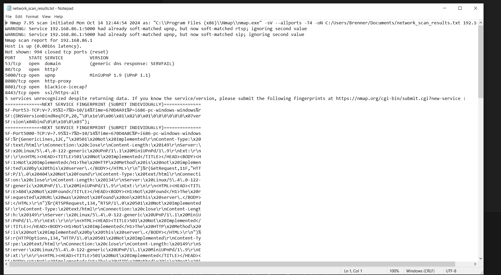

This script was originally from my senior design project, it was a prototype for network scanning and outputting to a readable text file
that would be input by another module. 

This script allows a user to input an IP address and it will scan all of the ports if the port option is left blank or it will scan the specified range.

Overall it isn't a super complex script and it was originally kind of a proof of concept, now it's a bit fleshed out so maybe we'll revisit this.
